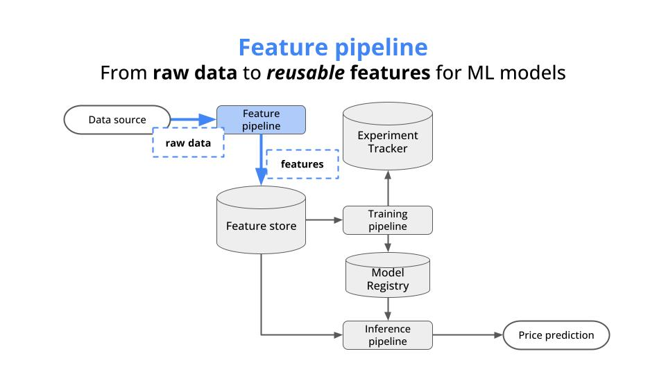
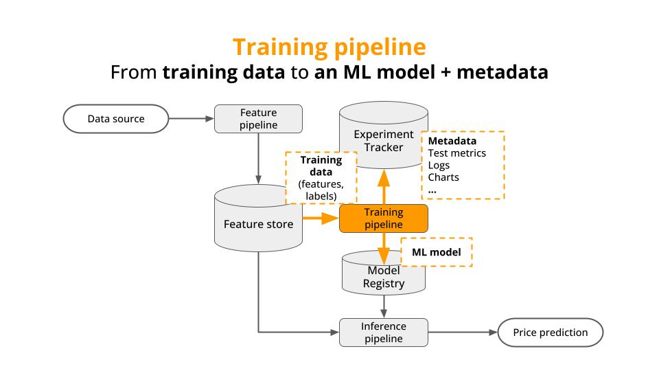
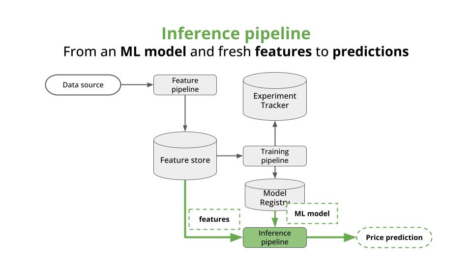

<div align="center">
    <h1>Why Rust?</h1>
    <h3><i>“In skating over thin ice, our safety is in our speed.”</i></h3>
<h4>― Ralph Waldo Emerson</h4>
    
</div>

#### Table of contents
* [The problem](#the-problem)
* [Solution](#solution)
* [Run the whole thing in 5 minutes](#run-the-whole-thing-in-5-minutes)
* [Wanna learn more real-time ML?](#wanna-learn-more-real-time-ml)


## The problem

Machine Learning systems are full of heavy compute operations, for example

* to do **feature engineering**, and transform raw data into model features

<div align="center">

</div>

* to **train ML models**, for example
    * a boosting algorithm like XGBoost trained on a tabular set of 100k rows, or
    * a deep neural network for image classification, or

<div align="center">

</div>

* to **generate predictions** from these models, for example to use Llama 3.1 to generate text completions.

<div align="center">

</div>

And the thing is, Python is a VERY SLOW language.

Python is an interpreted language, meaning code is executed line by line. This adds overhead compared to compiled languages, which translate code into machine instructions before execution.

And this is why all compute intense operations in Python programs are not really done by Python, but C libraries under the hood, like Numpy, PyTorch or XGBoost, among others.

However, this combo Python + C is not ideal for many real-world scenarios where performance and memory footprint are critical.

This is why 2 languages are growing in importance in the ML world,

- Mojo, which is still in a very early stage. Its mission is incredibly exciting: blend the expressiveness of Python with the performance of C into a single language. 

  It has a growing community that will surely push it very far. However, at the moment, it is still far to compete with Python for most real-world problems.

and

- Rust, which is a modern compiled language, that is already used to power popular Python libraries like Polars or tokenizers. Rust syntax is more involved than Python, but still way more accessible than C or C++, especially when using an AI coding assistant.

In this repository I will focus exclusively on Rust, to show you its power with one very simple example.


## Example

Let's take a very simple task. Let's use our computer to add numbers from `1` to `N=1,000,000,000` (1 billion)

We will write 3 programs to solve this task, in

- Pure Python
- Python + Numpy (written in C)
- Rust

and compare results and speed.

Let's start!

### 1. Python 🐍

The function loops over the range `1` to `N` and adds up the integers. Easy-peasy.

```python
def sum_up_to(n: int) -> int:
    count = 0
    for i in range(n):
        count += i + 1

    return count
```

To check its output and time to execute on your laptop, git clone this repository and run the following command from the root directoy of this repository.

```make
$ make time-python N=1000000000

sum up to 1000000000 is 500000000500000000

real    0m36.712s
user    0m36.112s
sys     0m0.400s
```

The result is correct, and the total time execute on my laptop is around 36 seconds.


### 2. Python + Numpy 🐍🚀

In this case, we allocate the range of integers in memory and ask numpy (written in C) to add them up.

```python
import numpy as np
result = np.sum(np.arange(args.number + 1))
```

To time it run
```make
$ make time-python-with-numpy N=1000000000

using numpy
sum up to 1000000000 is 500000000500000000

real    0m4.446s
user    0m1.630s
sys     0m4.134s
```

The result is correct, and the time to execute went down to 4 seconds on my computer. Nice!

What about Rust?

### 3. Rust 🦀

Rust is a modern compiled language, meaning that Rust code is translated directly into machine code by a compiler before execution. This leads to highly optimized performance because the program runs directly on the hardware without an intermediary.

On top of that, Rust syntax looks and feels way closer to Python than C. For example, this is what our summation function looks like:

```rust
fn sum_up_to(number: i64) -> u128{
    let mut sum = 0;

    for i in 0..number {
        sum += (i + 1) as u128;
    }

    sum
}
```

Let's now time it:

```make
$ make time-rust N=1000000000

sum up to 1000000000 is 500000000500000000

real    0m0.315s
user    0m0.002s
sys     0m0.003s
```

BOOM! Same result, while execution time went down to 0.3 seconds. That is 100x faster than Python.


> [!IMPORTANT]  
> To replicate this result on your computer first install the Rust compiler and Cargo
> ```
> curl --proto '=https' --tlsv1.2 -sSf https://sh.rustup.rs | sh
> ```


> #### What about real-world compuations?
>
> Adding up numbers is not very exciting. However, this serves as an easy-to-grasp example of how fast things can get when shifting from Python to Rust.
>
> Writing Rust programs is harder than Python. However, with the help of an AI coding assistant (like Copilot) the learning curve becomes flatter, and you can get up to speed with this language way faster.


## Wanna learn Rust with me?

I am preparing a new **live, interactive** course on [Rust for ML engineers](https://www.realworldml.net/courses).

We will build ML software, and learn along the way. Together.

[👉🏼👉🏾👉🏿 Click here to know more](https://www.realworldml.net/courses)